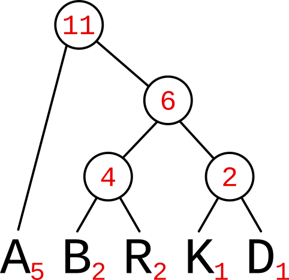
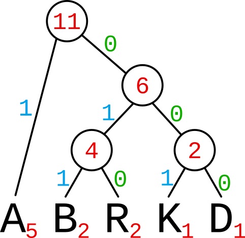
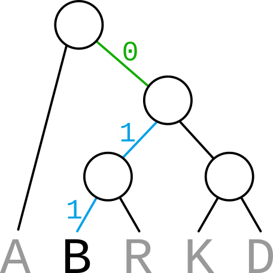
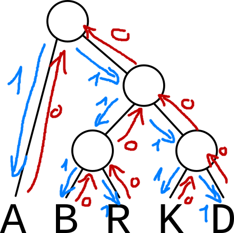

nazev = "Huffmanovo kódování"
tagy = ["unix", "crypto"]

+++

# Huffmanovo kódování

Jde o kompresní algoritmus, který využívá strom pro zakódování vstupu. Funguje na tom principu, že nejčastěji opakující-se znaky mají nejmenší bitový popis a nejméně časté znaky mají na svůj popis nejvíce bitů. My se věnujeme jen statickému Huffmanovo kódování.

Vlastnosti:

- Bezztrátový
- Asymetrický
- Dvou-průchodový

V praxi se využívá překvapivě často, například jako část komprese ve formátu JPEG při redukci opakujících-se pixelů.

## Postup zakódování

Pro příklad budeme mít vstup řetězec `ABRAKADABRA`.

### Seřazení znaků

Prvním krokem je důležité vyfiltrovat unikátní znaky, což jsou v tomto případě znaky `A B R K D`. Ke každému znaku zároveň připíšeme číslo označující počet výskytů znaku v řetězci.

Dále vypíšeme znaky seřazené sestupně (od nejvíce výskytů po nejméně výskytů). Seřazené znaky budou tvořit spodní část stromu.

{width=50%}

### Vytvoření stromu

K vytvoření stromu je třeba spojit dva objekty s nejmenším počtem výskytů a jejich počet sečíst. Pokud jsou více než dva objekty se stejným číslem, můžeme si libovolně vybrat.

{width=50%}

Každá objekt může mít pouze dva potomky. Tím je strom kompletní.

### Zakódování vstupu

Každou větev stromu si označíme, například levou větev jako 1 a pravou větev jako 0.

{width=50%}

Zakódování pak probíhá jen tak, že zmapuji cestu ke znaku.

{width=50%}

Znaky budou mít tedy tyto kódy:

```
A 1
B 011
R 010
K 001
D 000
```

Zakódování řetězce už je jen o popsání správných jedniček a nul podle vstupu.

```
ABRAKADABRA = 10110101001100010110101
```

## Postup dekódování

Dekódování funguje tak, že podle zakódovaného řetězce postupujeme hlouběji do stromu,dokud nenarazíme na znak.

```
1 011 010 1 001 1 000 1 011 010 1
A  B   R  A  K  A  D  A  B   R  A
```

Huffmanovo kódování je navrženo tak, že se při čtení zakódovaného řetězce nedostaneme do konfliktu a vždy přistaneme na správném znaku.

## Zakódování a rekonstrukce stromu

Když pošleme zakódovanou zprávu, příjemce jí bez stromu nedokáže dekódovat. Proto je nutné poslat i samotný strom.

Strom lze zakódovat tak, že ho celý projdeme. Každou cestu hlouběji do stromu označíme jako 1 a návrat zpět jako 0.

{width=50%}

Zakódovaný strom bude tedy `1011101001101000`. Spolu s ním musíme poslat i znaky ve stromu, tedy `ABRKD`.

Jeho rekonstrukce probíhá opačně, tj. podle zakódovaného řetězce stromu kreslíme větvě - při 1 jdeme do hloubky a při 0 se vracíme po větvi zpět.
