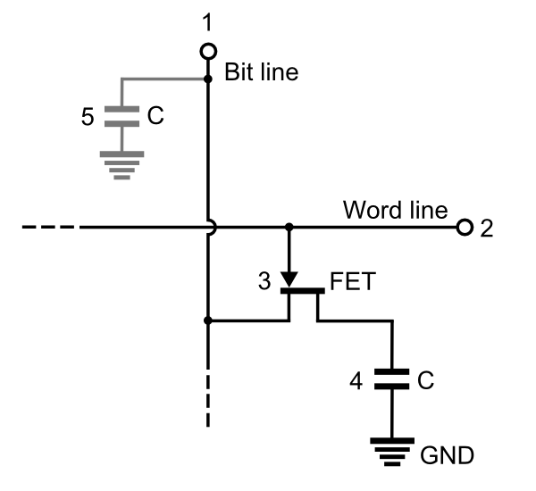

nazev = "Paměti"
tagy = ["unix", "pamet"]

+++
# Paměti ROM

## PROM

Programovatelná paměť, do které lze zapsat jen jednou.

## EPROM

Programovatelná paměť, kterou lze smazat UV zářením.

## EEPROM

Programovatelná paměť, kterou lze smazat elektrickým nábojem.

# Paměti RAM

- Lze přiepisovat bloky po bitech
    - To umožňuje tzv. *bit select* tranzistor
- Je třeba mít více tranzistorů na buňku

## DRAM

Dynamic RAM



- Je nutné ho neustále dobíjet
- Obsahuje pouze jeden FET
    - Jednoduché na výrobu
    - Levné
- Používá se v operačních pamětech

## SRAM

Static RAM


- Obsahuje invertory
- Není třeba neustále refreshovat
- Rychlé operace
- Postaven z šesti tranzistorů
    - Zabírá větší plochu
    - Je dražší na výrobu
- Používá se v CACHE pamětech

# Paměti FLASH

- Nevolatilní paměť
- Do buňky lze provést jen omezený počet zápisů
- Mažou se celé bloky (i během přepisu jednoho bitu)
    - blok paměti se smaže (logické 1)
    - relevantní bity se zapíší (pouze logické 0)

- Zápis je rychlý
- Mazání pro přepis je pomalé
    - TRIM u SSD

Běžné velikosti pamětí:

EEPROM|NOR|NAND
-|-|-
64K - 512K|512K - 128M|128M - nGB

Ovšem tyto velikoti se odvíjí od ceny. Lze vytvořit jakoukoliv velikost paměti.

## Floating-gate tranzistor

Varianta MOSFET s přidanou bránou, která dokáže uchovat záporný elektrický náboj (logická 1), nebo žádný náboj (logická 0).

```text
----------------+
                |
               Gate
                |            <- dielektrikum
      +---Floating gate---+
      |                   |  <- dielektrikum
--- Source               Drain --- GND
```

U jiných druhů (MLC, TLC, QLC) se jen přidají stavy náboje.

## NAND

- Paměť postavená na NotAND hradlech
- Počet zápisů je mezi 500 - 100000.
- Sekvenční přístup k datům

Druhy buňek:

SLC|MLC|TLC|QLC
:-:|:-:|:-:|:-:
1b|2b|3b|4b

## NOR

- Náhodný nebo sekvenční přístup k datům
- Použití u BIOS chipů, ovládacích IC u procesorů atd.
- Výhodou je vyšší životnost (nemusí ze přepisovat buňky v sekvenci)

# Magnetické paměti

## HDD

- Elektro-mechanické zařízení
- Data se ukládají maggnetizovaním sektorů na plotně
- Plotna je rozdělena na stopy a sektory od středu disku.

Hybridní HDD obsajují i paměť FLASH.

## Magnetická Páska

## Disketa

Disk rozdělen na sektory, stejně jako HDD.

# Optické paměti

- Data jsou na disku od středu směrem ke kraji
- Spirálový zápis
- Díra 0, plocha 1
- Laser se odráží (na ploše) do fotoelektického senzoru
- Objem uložitelných dat závisí na velikosti pitů a landů

Technologie|Objem dat|Velikost díry|Průměr paprsku|Vlnová délka ($\lambda$)
-|-|-|-|-
CD|0.7 GB|800x600 nm|1.6 um|780 nm
DVD|4.7 GB|400x320 nm|1.1 um|650 nm
Blu-ray|25 GB|150x130 nm|.48 um|405 nm

## DVD\+R vs. DVD\-R

\+ a \- označují metody zjištění relativní polohy laseru (čtecí hlavy). Metoda \- zjišťuje polohu pomocí převytvořených děr (*prepits*). Metoda \+ měří kmitání disku a jeho úroveň jeho vychýlení -- čím větší vychýlení, tím dále od středu se hlava nachází.

## RW

Fungují na principu fázového posunu světelného spektra. Zahřátím dojde k roztavení materiálu, který nepropouští světlo. Paprsek se pak neodrazí od reflektivní vrstvy do senzoru.

## MiniDisc

- Magneto-optické disky
- Magnet na disk zapisuje, laser čte
- Při zápisu laser nahřeje disk na 200° C

## Další formáty

- LaserDisc
- MiniCD
- MiniDVD
- UMD
- MiniDisc
