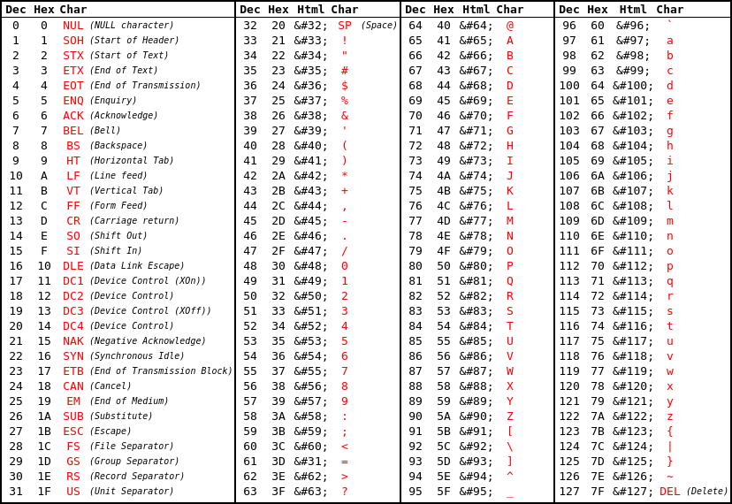

nazev = "Kódování znaků"
tagy = ["unix", "kodovani", "unicode"]
+++
# Kódování znaků

Dříve existovaly [teletypery/teleprintery](https://en.wikipedia.org/wiki/Teleprinter) - po síti byl poslán znak a tele-type ho natiskl na papír.

S příchodem počítačů vznikala spousta různých standardů. Například v Japonsku vznikly 4 různé standardy mezi sebou nekompatibilní. To při odeslání textu z jednoho počítače na druhý produkovalo jen rozházený text. V japonštině pro označení takové situace dokonce vzniklo slovo [mojibake](https://en.wikipedia.org/wiki/Mojibake).

## ASCII

American Standard Code for Information Interchange. Standard pro kódování znaků vytvořený primárně pro teleprintery. Znaky jsou kódovány v sedmi bitech. Počet možných znaků je tedy 128. Znaky mají přesně definované číslo, ke kterému patří.

Znak `A` je v ASCII definován jako `65 1000001` a znak `a` jako `97 1100001`. Lze tak jednoduše určit zakódované znaky *okem* přímo z binární soustavy.

{width=100%}

Z ASCII později vycházely standardy pro specifické jazyky, které mezi sebou nejsou kompatibilní.

## UTF-8

Standard prvotně načrtnutý na ubrousku v jídelně (Ken Thompson a Rob Pike). Unicode má seznam 277021 znaků ve verzi (11.0 červen 2018). UTF-8 může kódovat až 1112064 znaků.

>Příklad: Kdybychom chtěli zakódovat znak `A` přímo do např. 32b, dostali bychom `00000000000000000000000001000001`. To nám navýší velikost souboru 4.5 krát. Staré počítače zároveň vyhodnotí nulový byte `00000000` jako konec řetězce.

Pokud v UTF-8 chceme zakódovat znak, který patří do ASCII tabulky (jde zakovat v sedmi bitech), zakódujeme ho stejně a na začátek přidáme nulu, tedy `A 65 01000001`.

Další znaky se kódují pomocí hlaviček v bytech.

volné bity|byte 0|byte 1|byte 2|byte 3
-|-|-|-|-
11|110xxxxx|10xxxxxx
16|1110xxxx|10xxxxxx|10xxxxxx
21|11110xxx|10xxxxxx|10xxxxxx|10xxxxxx

`110` udává, kolik hlaviček v řetězci je. V dalším bajtu je hlavička `10`, která označuje začátek bloku. Prázdná místa `x` jsou použita jako datová. Pomocí hlaviček získáme strukturu dat a jejich odstraněním z řetězce bitů získáme samotná data.

UTF-8|Obsah bloků bez hlaviček|Číslo v base10
-|-|-|-
**110**10001**10**111000|10001111000|1114
**1110**1001**10**101110**10**011011|1001101110011011|39835

- Nenastane situace, kdy bude osm `0` za sebou
- Neplýtvá se místem
